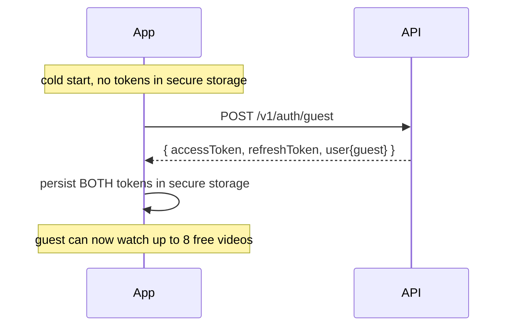
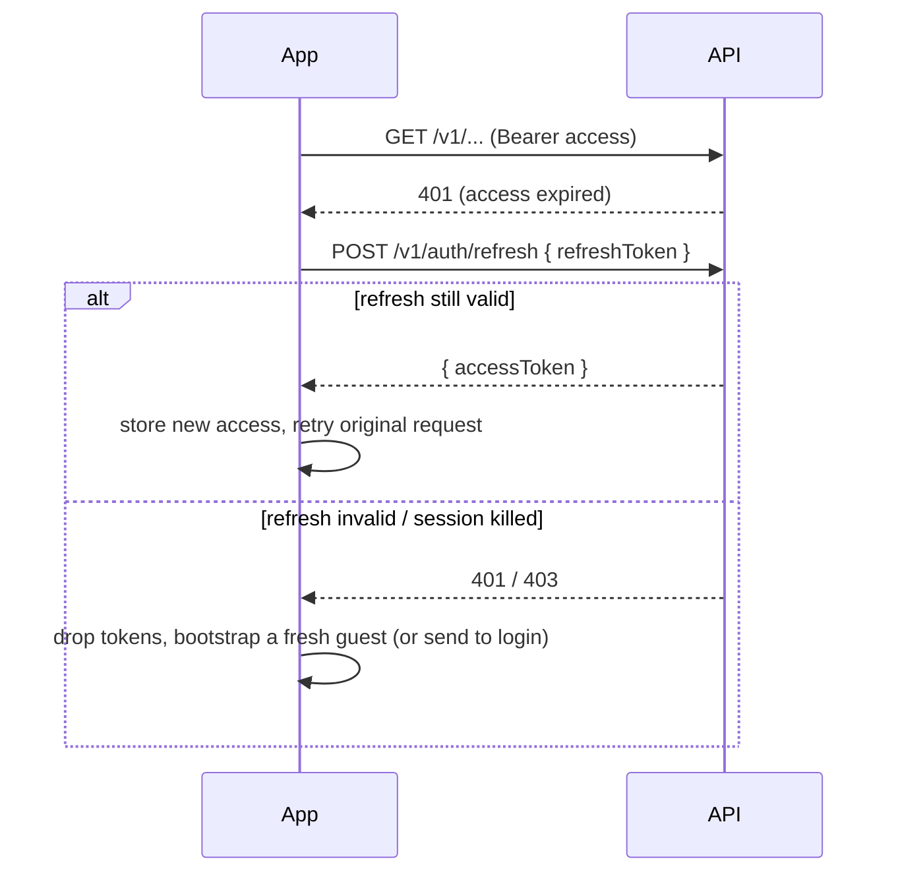
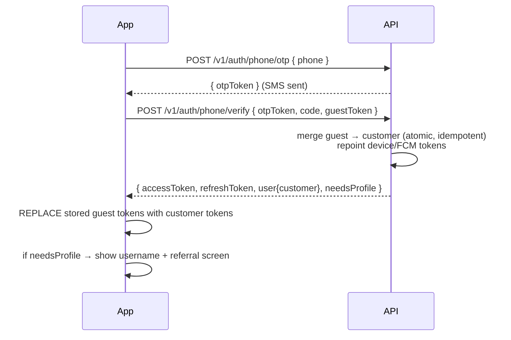
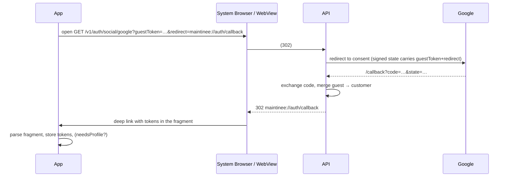
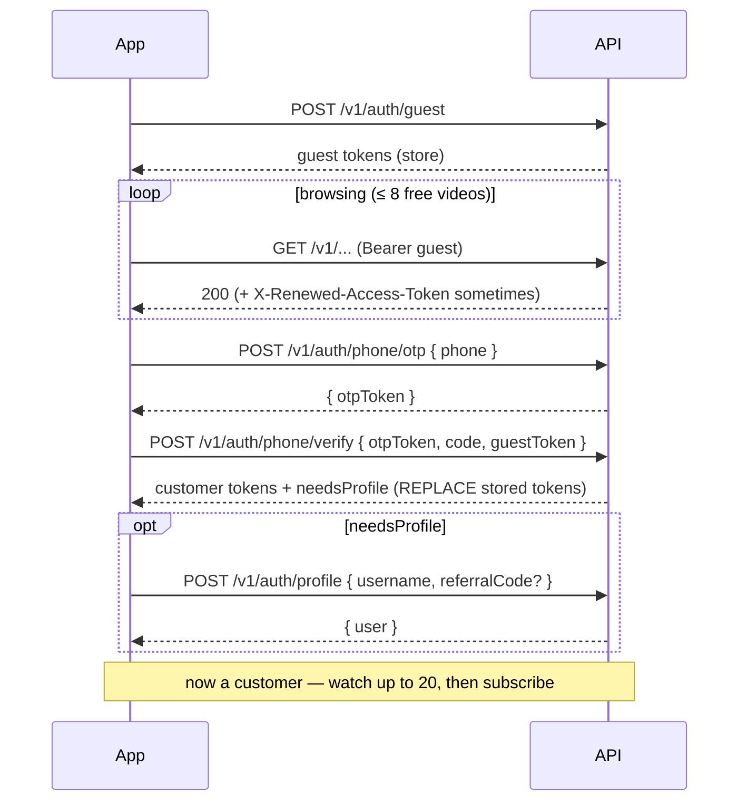

# Auth — Client Integration Guide

> How web (Next.js) and mobile (Flutter) clients integrate with the auth module:
> token storage, the request lifecycle, guest→customer merge, social OAuth, and
> refresh handling. Companion to `auth-api.md` (endpoint contract) and
> `auth-module-rfc.md` (design). Base URL (local): `http://localhost:3000`, business
> routes under `/v1`.

---

## 0. Who this is for

| Surface | Auth channel | Token storage |
|---------|--------------|---------------|
| **Mobile customer (Flutter)** | `Authorization: Bearer <accessToken>` | secure storage (Keychain / Keystore) |
| **Web admin (Next.js)** | httpOnly cookies (sent automatically by the browser) | the browser — JS never touches the token |

The **customer/guest** flow is token-in-header and client-managed (this guide's focus).
The **admin** flow is cookie-based and mostly automatic — see §7.

---

## 1. The token model (what the client must know)

- Every authenticated user — **including a guest** — holds a JWT **access + refresh** pair.
- **Access token**: short-lived (`JWT_ACCESS_TTL`, 15 min). Sent on every request. It is
  *self-contained* — it carries the account type, status, and (for admins) roles/permissions,
  so the server authorizes without a DB lookup.
- **Refresh token**: long-lived (`JWT_REFRESH_TTL`, 60 days for customers & guests). Used only
  to mint a new access token. Never sent as a Bearer header — only to `POST /v1/auth/refresh`.
- `accountType` inside the token is one of `guest | customer | admin`.

> The client treats a guest exactly like a logged-in user: same storage, same headers,
> same refresh logic. The *only* difference is what screens/features the app unlocks.

### Headers every customer/guest request sends
```
Authorization: Bearer <accessToken>
X-Client-Platform: mobile
Content-Type: application/json
```
`X-Client-Platform: mobile` forces the Bearer channel (vs. the web cookie channel). Always
send it from the app.

---

## 2. First launch — bootstrap a guest

On first launch (no stored tokens), create a guest and persist the pair.

```
POST /v1/auth/guest
→ 201 { data: { accessToken, refreshToken, user: { accountType: "guest", … } } }
```



- Persist **both** tokens in **secure, persistent** storage (not in-memory) so the guest —
  and their engagement (the 8 free videos, etc.) — survives an app restart.
- Do this **once**. Don't bootstrap a new guest on every launch; reuse the stored one.

---

## 3. Steady state — using & refreshing the token

The access token expires every 15 min. Mobile refresh is **client-driven**: refresh
on a `401` (or proactively, just before expiry) using the refresh token.

```
POST /v1/auth/refresh   { "refreshToken": "<stored refresh token>" }
→ 200 { data: { accessToken: "<new>" } }
```



**Recommended: a single HTTP interceptor** that attaches the Bearer header, catches `401`,
refreshes once, retries the original request, and (on refresh failure) clears tokens. Make
the refresh **single-flight** so concurrent 401s don't fire N refreshes.

#### Sliding renewal (free token rotation)
If the access token is within its last few minutes when you make a normal request, the
response includes a header:
```
X-Renewed-Access-Token: <new jwt>
```
If present, **adopt it** (overwrite the stored access token). It saves an explicit refresh
round-trip. Add this check to the same interceptor.

### Flutter (Dio) sketch
```dart
class AuthInterceptor extends Interceptor {
  // store: secure-storage wrapper holding access + refresh
  Future<String?>? _refreshing; // single-flight

  @override
  void onRequest(opt, handler) async {
    opt.headers['Authorization'] = 'Bearer ${await store.access}';
    opt.headers['X-Client-Platform'] = 'mobile';
    handler.next(opt);
  }

  @override
  void onResponse(res, handler) {
    final renewed = res.headers.value('x-renewed-access-token');
    if (renewed != null) store.setAccess(renewed); // adopt sliding renewal
    handler.next(res);
  }

  @override
  void onError(err, handler) async {
    if (err.response?.statusCode == 401 && !err.requestOptions.path.endsWith('/auth/refresh')) {
      final newAccess = await (_refreshing ??= _doRefresh());
      _refreshing = null;
      if (newAccess != null) {
        err.requestOptions.headers['Authorization'] = 'Bearer $newAccess';
        return handler.resolve(await dio.fetch(err.requestOptions)); // retry once
      }
      await store.clear();           // refresh failed → session is gone
      // → bootstrap a new guest or route to login
    }
    handler.next(err);
  }

  Future<String?> _doRefresh() async {
    try {
      final r = await dio.post('/v1/auth/refresh', data: {'refreshToken': await store.refresh});
      final access = r.data['data']['accessToken'] as String;
      await store.setAccess(access);
      return access;
    } catch (_) { return null; }
  }
}
```

---

## 4. Sign-up — guest → customer merge

This is the key flow. The client sends the **stored guest token** along with the sign-up
request; the server merges the guest into the new/existing customer and returns a **new
customer token pair**. The client then **replaces** its stored tokens.

### 4.1 Phone (OTP)
```
POST /v1/auth/phone/otp      { "phone": "+91..." }              → { otpToken }
POST /v1/auth/phone/verify   { otpToken, code, guestToken }     → { accessToken, refreshToken, user{customer}, needsProfile }
                                            ▲ stored guest token
```



- `otpToken` is a short-lived challenge token that binds verify to the phone you requested.
  Pass it back verbatim; don't resend the phone number on verify.
- `guestToken` may be the stored **access *or* refresh** guest token — either is accepted.
- After success, the guest row is soft-deleted server-side. The old guest token is now dead
  (its refresh returns 401, its access expires within ≤15 min). **Use only the new tokens.**
- If `needsProfile === true`, send the user to the profile step (§4.3).

### 4.2 Social (Google / Apple) — redirect OAuth
No SDK token exchange; this is a **server redirect** flow. The guest token rides in the
(signed) OAuth `state`.

```
GET /v1/auth/social/google?guestToken=<stored>&redirect=<your callback>
→ 302 to Google consent → … → 302 back to <redirect>#accessToken=…&refreshToken=…&isNewUser=…&needsProfile=…
```



Client responsibilities:
- **Mobile:** open the start URL in a system browser / `flutter_web_auth_2`-style session with a
  deep-link `redirect` (e.g. `maintinee://auth/callback`). On return, parse the URL **fragment**
  (`#…`) for `accessToken` / `refreshToken` / `isNewUser` / `needsProfile` and store them.
- **Web:** use an `https://…` `redirect` you control; read the fragment on that page.
- `redirect` **must be on the server allowlist** (`OAUTH_ALLOWED_REDIRECTS`) or the server falls
  back to the default — register your deep link / web callback there.
- Apple posts its callback as `form_post`; that's handled server-side — the client only deals
  with the final deep-link redirect.

### 4.3 Complete profile (username + referral)
After a sign-up that returns `needsProfile: true`:
```
POST /v1/auth/profile   { username, referralCode?, gender?, fullName? }   (Bearer customer token)
→ 200 { user }
```
- Each customer gets their **own** referral code automatically at sign-up; `referralCode` here
  is an *optional code they were referred by*. Invalid code → `400` (nothing half-applies).
- `409` → username taken.

---

## 5. Devices / push (FCM)

Register the device for push after auth (works for guest *and* customer):
```
POST /v1/devices   { fcmToken, platform: "ios|android|web", deviceId?, appVersion?, topics? }
DELETE /v1/devices/{fcmToken}
```
- On guest→customer merge, the server **repoints the guest's device tokens** to the customer
  automatically — the client doesn't re-register.
- An `fcmToken` already owned by a *different non-guest* account is rejected with `403`
  (anti-hijack). Register the **current device's own** FCM token only.

---

## 6. Token storage & session rules (checklist)

**Do**
- Store both tokens in **secure persistent storage** (Keychain / Keystore / `flutter_secure_storage`).
- Reuse the stored guest across launches; bootstrap a guest **only** when storage is empty.
- Send `Authorization: Bearer` + `X-Client-Platform: mobile` on every call.
- Refresh on `401`, single-flight, retry once; adopt `X-Renewed-Access-Token` when present.
- On refresh failure (`401`/`403`), **clear storage** and either bootstrap a fresh guest or
  route to login.
- After any sign-up/login response, **replace** the stored pair with the returned one.

**Don't**
- Don't keep using the guest token after a successful merge — it's dead.
- Don't send `guestToken` on requests after you're a customer (only on the *first* sign-up call).
- Don't store tokens in plain `SharedPreferences`/`localStorage` for mobile.
- Don't decode/trust token claims on the client for security decisions — treat tokens as opaque.

---

## 7. Admin (web) — brief

Admin is cookie-based and mostly hands-off for the client:
- `POST /v1/admin/auth/login` → server sets httpOnly `access_token` + `refresh_token` cookies
  and a non-httpOnly `csrf` cookie. The browser sends them automatically.
- Send `credentials: 'include'` on fetch/axios. For non-GET admin routes, echo the `csrf`
  cookie value in an `X-CSRF-Token` header (when `CSRF_ENABLED=true`).
- The guard transparently refreshes the access cookie from the refresh cookie on expiry —
  the SPA usually does nothing. On a hard `401`, route to the admin login page.

---

## 8. Status / error handling the client should implement

| HTTP | Meaning | Client action |
|------|---------|---------------|
| 401 | access expired / invalid | refresh once → retry; if refresh fails, clear & re-auth |
| 403 + `code: ACCOUNT_SUSPENDED/BANNED/DISABLED` | account moderated | stop, show the message (+`suspendedUntil` if present); don't loop refresh |
| 409 | phone/email/username already in use | surface "already registered" / "username taken" |
| 429 | throttled (OTP flood, login attempts) | back off; show "try again shortly" |
| 400 | validation | show field errors |

A `403` with an `ACCOUNT_*` code is **terminal** for that session — refreshing won't help
(the status travels in the token and is re-checked at refresh). Show the reason and send the
user to a dead-end/appeal screen rather than retrying.

---

## 9. End-to-end happy path (one diagram)


