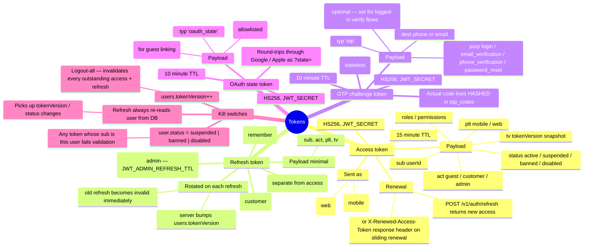

# Token Machinery

> How access tokens, refresh tokens, OTP challenge tokens and OAuth state tokens are
> issued, verified, and invalidated. The single kill-switch (`tokenVersion`) is the whole
> story of "log me out of everything."

---

## 1. Mind map



---

## 2. Four token types at a glance

| Token | TTL | Secret | Payload | Purpose |
|---|---|---|---|---|
| **Access** | 15m (`JWT_ACCESS_TTL`) | `JWT_SECRET` | `{sub, act, plt, tv, status, roles, permissions}` | Bearer / cookie on every authed call |
| **Refresh** | 60d (`JWT_REFRESH_TTL`) | `JWT_REFRESH_SECRET` (falls back to `JWT_SECRET`) | `{sub, act, plt, tv}` | Traded at `/v1/auth/refresh` for a new access |
| **OTP challenge** | 10m (`OTP_CHALLENGE_TTL`) | `JWT_SECRET` | `{typ:'otp', dest, purp, sub?}` | Binds a verify request to the destination the user asked about |
| **OAuth state** | 10m | `JWT_SECRET` | `{typ:'oauth_state', gt?, rd?}` | Tamper-proof carrier through the OAuth redirect |

All are **stateless JWTs** — no server-side blacklist, no session store. Verification is signature + claims + `tokenVersion` re-check on refresh.

---

## 3. Where each is issued

| Endpoint | Access | Refresh | Challenge / State |
|---|---|---|---|
| `POST /v1/auth/guest` | ✅ | ✅ | — |
| `POST /v1/auth/phone/otp` | — | — | ✅ otpToken `{dest:phone, purp:'login'}` |
| `POST /v1/auth/phone/verify` | ✅ (customer) | ✅ | — |
| `GET /v1/auth/social/google` | — | — | ✅ oauth_state `{gt, rd}` |
| `.../google/callback` | ✅ (via URL fragment) | ✅ (via URL fragment) | — |
| `POST /v1/auth/refresh` | ✅ (fresh) | — | — |
| `POST /v1/profile/email/verify/request` | — | — | ✅ otpToken `{dest:email, purp:'email_verification', sub:userId}` |

---

## 4. The tokenVersion kill-switch

Every access token embeds `tv` — a snapshot of the user's `token_version` at issue time.

**On every refresh:**
```ts
// Pseudocode from session.service.refresh()
const payload = jwt.verifyRefresh(refreshToken);
const user = await users.findById(payload.sub);
if (!user || user.tokenVersion !== payload.tv || user.status !== 'active') {
  throw new UnauthorizedException();
}
users.bumpTokenVersion(user.id);          // increment
return sign(newAccessToken, { ..., tv: user.tokenVersion + 1 });
```

**How each "log out" flavour works:**

| Action | Effect |
|---|---|
| `POST /v1/auth/logout` | Client-side only — server does nothing. Old access token keeps working until it expires (up to 15m). |
| `POST /v1/auth/logout-all` | `users.tokenVersion++`. Every outstanding refresh becomes invalid on next `/refresh` call. Access tokens survive at most `JWT_ACCESS_TTL` (15m) since they don't hit refresh. |
| Admin suspends / bans a user | `users.status` change. Every next `/refresh` rejects. Live access tokens survive at most 15m. |

**Practical implication for mobile:**
- Client must silently call `/refresh` when it sees a 401 with `access token expired`
- If `/refresh` returns 401, prompt the user to log in again

---

## 5. Header conventions

| Header | Direction | Purpose |
|---|---|---|
| `Authorization: Bearer <accessToken>` | request → server | Mobile auth channel |
| `Cookie: access_token=<jwt>` | request → server | Web (admin) auth channel; browser sets automatically |
| `X-Client-Platform: mobile\|web` | request → server | Optional override — the guard auto-detects otherwise |
| `X-CSRF-Token: <token>` | request → server | Non-GET admin routes when `CSRF_ENABLED=true` — must match `csrf` cookie |
| `X-Renewed-Access-Token: <jwt>` | server → response | Sliding-renewal signal (mobile) — client should adopt this token for future requests |
| `Set-Cookie: access_token=<jwt>` | server → response | Sliding-renewal (web) — browser handles automatically |

---

## 6. Secrets & env

| Env | Meaning | Required? |
|---|---|---|
| `JWT_SECRET` | Signs access + OTP challenge + OAuth state | Yes (production must not use dev default) |
| `JWT_REFRESH_SECRET` | Signs refresh tokens (separate from access) | Optional — falls back to `JWT_SECRET` |
| `JWT_ACCESS_TTL` | Seconds | Default `900` (15m) |
| `JWT_REFRESH_TTL` | Seconds | Default `5184000` (60d) |
| `JWT_ADMIN_REFRESH_TTL` | Seconds | Default `43200` (12h) — shorter for admin |
| `JWT_REMEMBER_TTL` | Seconds | Default `2592000` (30d) — "remember me" |
| `JWT_RENEW_WINDOW` | Seconds | Default `300` — sliding renewal window |
| `COOKIE_SECURE` | HTTPS-only cookies | `true` in production |
| `CSRF_ENABLED` | Enforce CSRF token on admin writes | `true` in production |

---

## 7. Where it lives in code

| Concern | File |
|---|---|
| Signing / verifying all four token types | `src/auth/services/token.service.ts` |
| Refresh + rotation logic | `src/auth/services/session.service.ts` |
| JwtAuthGuard (global) | `src/auth/guards/auth.guard.ts` |
| `@Public()`, `@CustomerOnly()`, `@Roles()`, `@Permissions()` decorators | `src/auth/decorators/` |
| `AccountTypeGuard`, `RolesGuard`, `PermissionsGuard` | `src/auth/guards/` |

---

## 8. Cheat sheet — what the mobile client should do

```
Startup
  1. Read stored accessToken + refreshToken from secure storage
  2. Attach Authorization: Bearer <accessToken> on every request
  3. On any 401 → try POST /v1/auth/refresh { refreshToken }
       - success → store new accessToken, retry original request once
       - failure → clear tokens, route to Sign In
  4. Watch for X-Renewed-Access-Token in response headers → adopt silently

Sign in flow (phone)
  1. POST /v1/auth/phone/otp { phone } → save otpToken (in-memory only)
  2. User enters code / Firebase client provides idToken
  3. POST /v1/auth/phone/verify { otpToken, code|firebaseToken } → save token pair

Sign in flow (Google)
  1. Open GET /v1/auth/social/google?redirect=myapp://oauth in an in-app browser
  2. Intercept the deep-link redirect, parse #accessToken=... from the fragment
  3. Save token pair

Sign out
  - Locally: discard tokens
  - Sign out everywhere: POST /v1/auth/logout-all → then discard local tokens
```
