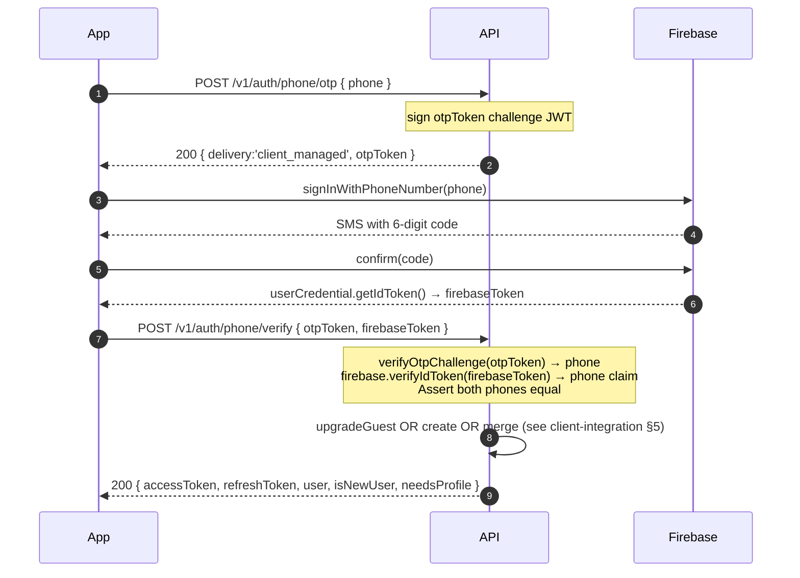
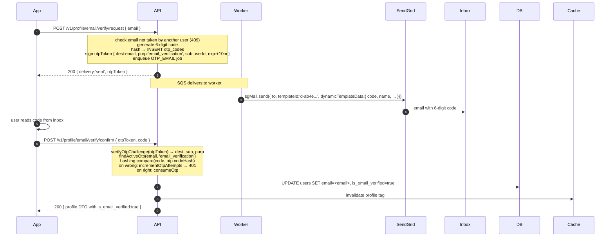

# Verification Flows — Email OTP, Phone OTP, Username Check

> Companion to `auth-api.md` (endpoint contract) and `auth-module-rfc.md` (design).
> Covers the verification/OTP endpoints and how the **temp-token** pattern authenticates
> the confirm step without a Bearer.

---

## Mind map — verification surface

```mermaid
mindmap
  root((Verification))
    Username availability
      GET /v1/auth/username/available
        Public, throttled 30/min
        Response { available: bool }
    Phone OTP
      Request POST /v1/auth/phone/otp
        Returns otpToken (challenge JWT, 10m)
      Verify POST /v1/auth/phone/verify
        Body { otpToken, code | firebaseToken, guestToken? }
      Providers env-selected
        Firebase (client-managed OTP)
        Twilio (server-managed OTP + otp_codes)
    Email OTP
      Request POST /v1/profile/email/verify/request
        Bearer required
        Returns otpToken with sub=userId
      Confirm POST /v1/profile/email/verify/confirm
        Public — otpToken IS the auth
        Body { otpToken, code }
      Provider env-selected
        SendGrid dynamic template (SDK)
        SMTP or SES via nodemailer + Handlebars
        log (dev) — prints + Redis stash
    Temp-token pattern
      Signed JWT
      Binds destination + purpose + (optional) sub
      10 minute TTL
      6-digit hashed code in otp_codes
        max 5 attempts
```

---

## 1. The temp-token pattern (why we have `otpToken`)

Every OTP flow returns a **challenge JWT** on the request step and requires it back on the confirm step. Two problems it solves:

| Attack / edge case | Without temp token | With temp token |
|---|---|---|
| Submit a code for a **different destination** than what was requested | ✅ passes if code happens to be valid | ❌ rejected — destination is inside the signed JWT |
| Session expires between request and confirm | ❌ user has to log in again | ✅ works — `sub` (userId) can be embedded in the JWT |
| Attacker guesses a code out-of-band | ⚠️ email + code = win | ❌ they also need the exact challenge JWT |

**JWT payload:**
```
typ:  'otp'
dest: '<phone or email>'
purp: 'login' | 'email_verification' | 'phone_verification' | 'password_reset'
sub:  '<userId>'         // OPTIONAL — set when caller was already authenticated
exp:  now + 10min
jti:  <random>
```
Signed with `JWT_SECRET`, algorithm HS256.

Implementation: `TokenService.signOtpChallenge(dest, purp, sub?)` / `verifyOtpChallenge(token)` in `src/auth/services/token.service.ts`.

---

## 2. Username availability

```
GET /v1/auth/username/available?username=<name>
```

| | |
|---|---|
| Auth | Public |
| Throttle | 30 requests / minute (debounced typing) |
| Validation | 3–50 chars, `[a-zA-Z0-9_.]` |
| Response | `{ available: boolean }` |

Used by the **Create Account** screen to show inline red/green feedback as the user types, instead of failing on submit with a 409.

Uniqueness enforcement happens at write time regardless (`POST /v1/auth/profile`, DB unique index on `users.username`).

---

## 3. Phone OTP

```
POST /v1/auth/phone/otp     { phone }
  → 200 { delivery: 'sent' | 'client_managed', otpToken }

POST /v1/auth/phone/verify  { otpToken, code | firebaseToken, guestToken? }
  → 200 { accessToken, refreshToken, user, isNewUser, needsProfile }
```

**Provider strategy** — flip via `PHONE_VERIFICATION_PROVIDER` env:

| Value | How it works |
|---|---|
| `firebase` | Client SDK sends the SMS, calls `signInWithPhoneNumber` → confirms → gets a Firebase **ID token**. Client submits `{ otpToken, firebaseToken }`. Server calls `firebase-admin`'s `verifyIdToken` and extracts the `phone_number` claim. |
| `twilio` (default) | Server generates a 6-digit code, hashes it into `otp_codes`, enqueues an SMS job. Worker sends via Twilio. Client submits `{ otpToken, code }`. Server compares hashes. |

**SMS provider** (worker side, independent of phone-verification-provider) — flip via `SMS_PROVIDER`:
- `twilio` — real SMS via Twilio API
- `sns` — AWS SNS
- `log` — dev-only: prints to console + stores plaintext code in Redis at `dev:otp:sms:<phone>` for `GET /dev-tools/otp?dest=<phone>&channel=sms`

**Rate limiting:** `POST /phone/otp` is throttled 5/min short + 20/30min long. `POST /phone/verify` is throttled 10/min.

**Guest linking:** if `guestToken` is passed to `verify`, the guest row is either **upgraded in place** (same UUID, preserves all engagement) or **merged into the existing customer** (soft-deleted with `merged_into_user_id` pointer). See `client-integration.md` §5.

### Firebase phone-OTP sequence



---

## 4. Email OTP (temp-token flow, no Bearer on confirm)

Design screen: **Edit Profile** → change Email → "Verify email" button.

### Endpoints

| Method | Path | Auth | Notes |
|---|---|---|---|
| `POST` | `/v1/profile/email/verify/request` | `@CustomerOnly` | Sends OTP to the new email |
| `POST` | `/v1/profile/email/verify/confirm` | `@Public` + `@AccountTypes()` | otpToken IS the auth (session-independent) |

### Full sequence



### Request/response shape

```jsonc
// Request
POST /v1/profile/email/verify/request
Authorization: Bearer <customer-access-token>
{ "email": "jordan@example.com" }

// Response
200 {
  "data": {
    "delivery": "sent",
    "otpToken": "eyJhbGciOi..."   // pass this back to /confirm
  }
}
```

```jsonc
// Confirm — no Authorization header needed
POST /v1/profile/email/verify/confirm
{ "otpToken": "eyJhbGciOi...", "code": "123456" }

// Response
200 {
  "data": { /* full ProfileDto with email + is_email_verified:true */ }
}
```

### Providers

Flip via `EMAIL_PROVIDER` env. All go through the SAME worker job (`QueueName.EMAIL` + `JobName.OTP_EMAIL`) — no code changes.

| Value | How it sends |
|---|---|
| `sendgrid` | `@sendgrid/mail` SDK → dynamic template ID `EMAIL_TEMPLATES.SIGNUP_OTP` (`d-ab4e880fe39140b7b342677de68cdfb4`) with `dynamicTemplateData: { name, otp, code, expiresIn, appName, year }` |
| `smtp` / `ses` | nodemailer + local Handlebars template `mfa-code.hbs` |
| `log` (dev) | Prints to console + stashes plaintext code in Redis at `dev:otp:email:<address>` for `GET /dev-tools/otp?dest=<email>&channel=email` |

### SendGrid setup checklist

1. `.env`:
   ```
   EMAIL_PROVIDER=sendgrid
   SENDGRID_API_KEY=SG.<your-key>
   SENDGRID_FROM_EMAIL=support@your-domain.com   # or EMAIL_FROM
   SENDGRID_FROM_NAME=<your app name>            # optional
   ```
2. Restart the backend (env changes need full restart).
3. Verify the sender in SendGrid Console → Settings → Sender Authentication → **Verify a Single Sender** (fastest) OR **Domain Authentication** (better for production). SendGrid rejects any send whose `from` address isn't verified.
4. Template lives in SendGrid → Design a New Template → Dynamic Template. Use `{{code}}`, `{{name}}`, `{{expiresIn}}`, `{{appName}}`, `{{year}}` as Handlebars variables. Template IDs are centralized in `src/email/constants/email-templates.constants.ts`.

### Guardrails baked into the flow

- Email is **NOT written** to `users.email` on the request step — only on successful confirm. A typo can't leave the account with a broken contact address.
- Each request **invalidates** any previous unconsumed OTP for the same `(destination, purpose)` (via `otp_codes.consumedAt = now()` inside `createOtp`).
- Wrong code increments `otp_codes.attempts`; after 5 attempts the OTP is dead — user must request a new one.
- Uniqueness re-checked at confirm (409 if a concurrent user claimed the email in the 10-min window).
- Rate limits: request `5/min short + 20/30min long`, confirm `10/min`.

---

## 5. Where each moving part lives

| Concern | File |
|---|---|
| Phone request / verify endpoints | `src/auth/customer/customer-auth.controller.ts` |
| Phone verify service | `src/auth/customer/customer-auth.service.ts` (`requestPhoneOtp`, `verifyPhone`) |
| Firebase phone provider | `src/auth/providers/firebase-phone.provider.ts` |
| Twilio OTP provider | `src/auth/providers/twilio-otp.provider.ts` |
| Firebase Admin verifier | `src/auth/services/firebase-admin.service.ts` |
| Username availability endpoint | `src/auth/customer/customer-auth.controller.ts` (`checkUsername`) |
| Email verify endpoints | `src/profile/self/profile.controller.ts` (`requestEmailOtp`, `confirmEmailOtp`) |
| Email verify service | `src/profile/self/profile.service.ts` (`requestEmailVerification`, `confirmEmailVerification`) |
| OTP challenge JWT | `src/auth/services/token.service.ts` (`signOtpChallenge`, `verifyOtpChallenge`) |
| `otp_codes` repository | `src/db/repositories/auth/identity.repository.ts` |
| Email worker | `src/background/email/email.handler.ts` + `email-job.service.ts` |
| SendGrid provider | `src/email/providers/sendgrid.provider.ts` |
| Template IDs constant | `src/email/constants/email-templates.constants.ts` |
| DTO — username check | `src/auth/customer/dto/check-username.dto.ts` |
| DTO — email verify | `src/profile/dto/verify-email.dto.ts` |

---

## 6. Test scripts

Under `apps/backend/scripts/`:

| Script | Purpose |
|---|---|
| `test-firebase-otp.mjs` | Full Firebase phone-OTP path via admin bypass (no browser, no SMS) |
| `send-email-otp.mjs` | Sign up a customer, hit `/email/verify/request`, print otpToken + a ready-to-run confirm curl |
| `test-email-verify.mjs` | Full email-verify happy path (auto-reads code from `/dev-tools/otp` when `EMAIL_PROVIDER=log`, otherwise prompts) |

Run examples:
```bash
cd apps/backend
node scripts/test-firebase-otp.mjs +919000000001
node scripts/send-email-otp.mjs "+919000$RANDOM$RANDOM" you@example.com
node scripts/test-email-verify.mjs you@example.com                       # will prompt for the code
```

---

## 7. What's built vs pending

| Piece | Status |
|---|---|
| Username availability pre-check | ✅ |
| Phone OTP (Firebase) | ✅ |
| Phone OTP (Twilio) | ✅ |
| Guest → customer transition on verify | ✅ |
| **Email verify request + confirm (temp-token)** | ✅ |
| SendGrid dynamic-template send | ✅ (via SDK) |
| SMTP / SES / log fallback | ✅ |
| Rate limits + attempt caps | ✅ |
| **Phone-change flow** (change existing user's phone) | ❌ not built — see `phone-change` future doc |
| Password reset via email OTP | ❌ not wired yet (schema supports `purpose='password_reset'`) |
