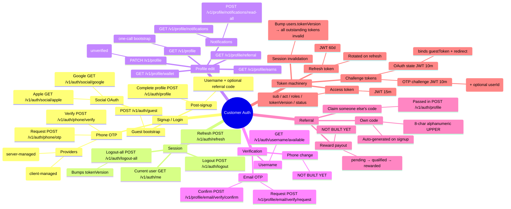
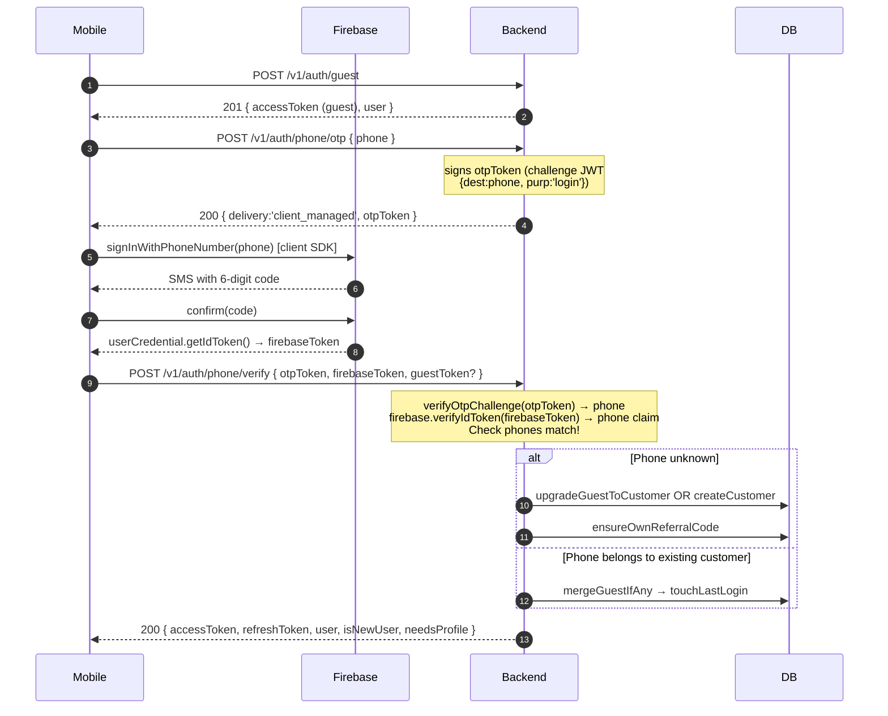
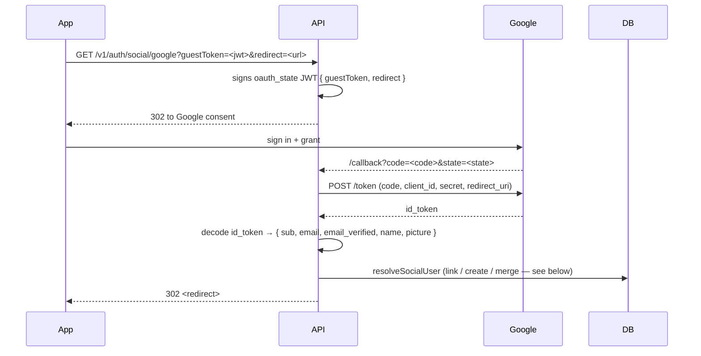
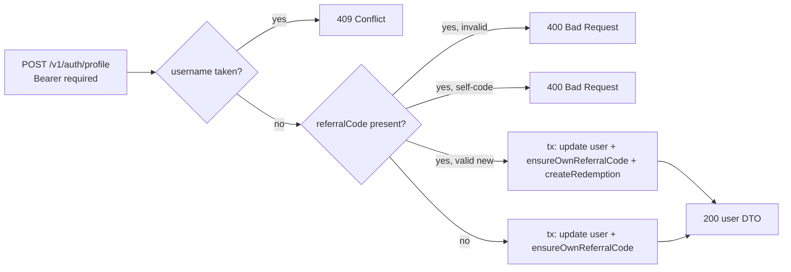
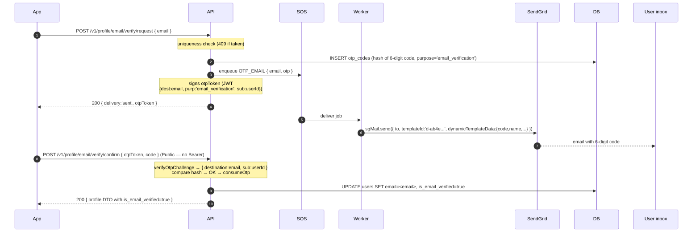

# Customer Auth, Profile, Referral & OTP Flows

Everything the mobile app (and admin, when applicable) uses for signup, login, profile
edit, email verification, referral, and the token machinery underneath. Bookmark this — it
answers "which endpoint do I call for X, and what happens on the server?"

---

## Mind map — the whole surface at a glance



---

## 1. Signup / login flows

### 1a. Phone OTP — Firebase path (default in dev)



### 1b. Phone OTP — Twilio path

Same shape, except step 3–4 change:

- Server generates the 6-digit code, hashes to `otp_codes`, enqueues an SMS job.
- Worker sends the SMS via Twilio.
- Client submits `{ otpToken, code }` (no `firebaseToken`).

Switch via env: `PHONE_VERIFICATION_PROVIDER=firebase | twilio` (default `twilio`).

### 1c. Social OAuth (Google, Apple)



**Redirect priority** (`buildSuccessRedirect`):
1. `?redirect=<url>` if allowed by `OAUTH_ALLOWED_REDIRECTS`
2. `OAUTH_SUCCESS_REDIRECT` env var
3. Hardcoded fallback `maintinee://auth/callback`

**Tokens are always in the URL fragment** (`#accessToken=...`), never the query — fragments don't hit server logs.

**Avatar handling:** if `profile.picture` is returned by the provider, it's saved to `users.avatarUrl` (only when the user has no avatar yet — `setAvatarIfEmpty` guard).

### 1d. Guest → customer transition (in-place vs merge)

| Scenario | What happens | Preservation |
|---|---|---|
| Phone/OAuth unknown | `upgradeGuestToCustomer` — flips `account_type='customer'` on same UUID | ✅ All guest engagement preserved (same row) |
| Phone/OAuth already tied to a customer | `mergeGuestInto` — sets guest.`merged_into_user_id` + `deleted_at`, repoints device tokens | ⚠️ Only device tokens moved; wallet/watch/streak stay on the soft-deleted row |

---

## 2. Complete profile (post-signup one-time write)

Design screen: **Create Account** ("Tell us a little bit about yourself" — username + optional referral).



**Endpoint:** `POST /v1/auth/profile`  
**Auth:** `@CustomerOnly` (Bearer)  
**Body:**
```jsonc
{
  "username": "madison",           // 3-50 chars, [a-zA-Z0-9_.]
  "referralCode": "X5J7T0LE",      // optional
  "fullName": "Madison Smith",     // optional
  "gender": "female"               // optional
}
```

**Pre-check (typing UX):** `GET /v1/auth/username/available?username=<name>` — returns `{ available: boolean }`. Public, rate-limited 30/min.

**Guarantees on success:**
- `users.username` written (unique)
- `referral_codes` row exists for this user (auto-generated 8-char code)
- If `referralCode` was passed: `referral_redemptions` row with `referrer_id`, `referee_id`, `status='pending'`

---

## 3. Profile edit (ongoing)

Design screen: **Edit Profile** — name, email, phone, avatar, Save Changes.

**Endpoint:** `PATCH /v1/profile`  
**Auth:** `@CustomerOnly` (Bearer)  
**Body (all optional, partial update):**
```jsonc
{
  "firstName": "John",
  "lastName": "Doe",
  "bio": "Movie buff",
  "gender": "male",
  "avatarMediaId": "01a0...",     // uuid from media upload
  "avatarUrl": "https://...",     // OR external URL
  "countryCode": "US",
  "timezone": "America/New_York",
  "email": "john@example.com"     // stored UNVERIFIED — see next section
}
```

**Rules:**
- Setting `email` writes `users.email` and resets `isEmailVerified=false`. No OTP is sent by PATCH.
- **Phone is NOT editable here** — needs a dedicated re-verification flow (not yet built).
- **Username is NOT editable here** — it's identity, set once at signup.
- Email uniqueness enforced with a 409 on conflict.

---

## 4. Email verification (temp-token flow — no Bearer on confirm)

Two-step. The request step needs a customer Bearer; the confirm step is authenticated by the challenge JWT itself, so it survives a session logout mid-flow.



**Endpoints:**
| Method | Path | Auth |
|---|---|---|
| `POST` | `/v1/profile/email/verify/request` | `@CustomerOnly` |
| `POST` | `/v1/profile/email/verify/confirm` | `@Public` + `@AccountTypes()` (temp token IS the auth) |

**Providers (env-driven, no code change):**
| `EMAIL_PROVIDER` | Behavior |
|---|---|
| `sendgrid` | `@sendgrid/mail` SDK → dynamic template `EMAIL_TEMPLATES.SIGNUP_OTP` (`d-ab4e...`) |
| `smtp` / `ses` | nodemailer + local Handlebars template `mfa-code.hbs` |
| `log` | prints to console + stashes code in Redis (peekable at `/dev-tools/otp?dest=<email>&channel=email`) |

**Guardrails:**
- Email is NOT written to `users.email` on request — only on successful confirm
- OTP lives in `otp_codes`, 10-min TTL, max 5 attempts (increments on wrong code)
- Requesting a new OTP consumes any previous unconsumed OTP for the same (dest, purpose)
- Rate-limited: request 5/min short + 20/30min long; confirm 10/min

---

## 5. Phone OTP — server-managed path (Twilio)

Similar shape to email verification but for phone. Uses `otp_codes` with `channel='sms', purpose='login'` (or `phone_verification` for the change-phone flow, not yet built).

Same 6-digit hashed code, same `otp_codes` row, same otpToken challenge JWT. Only difference: sent via SMS worker (`SMS_PROVIDER=twilio|sns|log`) instead of email worker.

---

## 6. Referral flow

### 6a. Auto-generated code on signup

Every customer gets one. Generated in `ensureOwnReferralCode(userId)`:

```
randomBytes(6).toString('base64url')
  .replace(/[^A-Za-z0-9]/g, '')
  .slice(0, 8).toUpperCase()
```

Result: 8-char alphanumeric uppercase like `X5J7T0LE`, `CH8362`, `BR2MJWBV`. Stored in `referral_codes` (unique per user + unique code).

Called in three places (idempotent — `findCodeByUser` checked first):
- `verifyPhone` (phone signup)
- `resolveSocialUser` (Google/Apple signup)
- `completeProfile` (belt-and-braces fallback)

### 6b. Claiming someone else's code

In `POST /v1/auth/profile` (Create Account), the user can enter a referral code:

```mermaid
flowchart TB
    A[POST /v1/auth/profile with referralCode] --> B{Have I already redeemed one?}
    B -->|yes| SKIP[silently skip — idempotent no-op]
    B -->|no| C{Code owner exists?}
    C -->|no| E1[400 Invalid referral code]
    C -->|yes| D{Owner is me?}
    D -->|yes| E2[400 You cannot use your own code]
    D -->|no| F[INSERT referral_redemptions<br/>{code, referrer_id, referee_id, status:'pending'}]
```

Data stored:
| Column | Value |
|---|---|
| `code` | the code entered |
| `referrer_id` | owner of that code |
| `referee_id` | the new user (**UNIQUE** — can only be referred once ever) |
| `status` | `'pending'` |
| `created_at` | now() |

### 6c. Reward payout — NOT YET BUILT

The schema supports the full lifecycle:
```
pending → qualified → rewarded → (or reverted)
```

Missing pieces:
- Logic to advance to `qualified` (needs product decision: after phone verify? first watch? first subscription?)
- `ledger_transactions` row with `sourceType='referral'` for both parties
- Setting `rewarded_at`
- Notification to the referrer

Once the product criteria are decided, this becomes a service call in `ReferralService.qualifyReferrals()` — worker/cron-driven.

---

## 7. Token machinery — how sessions work

### Three flavours of token, three purposes

| Token | Encoded fields | TTL | Where used |
|---|---|---|---|
| **Access** | `{sub, act, plt, tv, status, roles, permissions}` | 15 min | Bearer on every authenticated call |
| **Refresh** | `{sub, act, plt, tv}` | 60 days | Sent to `/v1/auth/refresh` to mint a new access token |
| **OTP challenge** | `{dest, purp, sub?}` | 10 min | Returned by request-OTP, submitted with verify — binds the destination to this session |
| **OAuth state** | `{gt: guestToken?, rd: redirect?}` | 10 min | Round-trips through Google/Apple as `state=...` |

All signed with the same JWT_SECRET (HS256). Refresh uses a separate secret.

### tokenVersion — the master kill-switch

Every access token carries `tv` (the user's current `token_version`). On refresh, the server:
1. Verifies the refresh token
2. Reads the user's current `tokenVersion` from DB
3. Rejects if the refresh token's `tv` is older
4. Increments `tokenVersion` (rotation)
5. Issues a new pair

**Logout-all** simply bumps `users.tokenVersion`. Every outstanding access + refresh token silently becomes invalid at next validation. No token blacklist needed.

### Where each token is issued

| Endpoint | Access | Refresh | Challenge |
|---|---|---|---|
| `POST /v1/auth/guest` | ✅ | ✅ | — |
| `POST /v1/auth/phone/otp` | — | — | ✅ (otpToken) |
| `POST /v1/auth/phone/verify` | ✅ (customer) | ✅ | — |
| `GET /v1/auth/social/google` | — | — | ✅ (oauth state) |
| `GET /v1/auth/social/google/callback` | ✅ (customer, via fragment) | ✅ (via fragment) | — |
| `POST /v1/auth/refresh` | ✅ (new) | — (same refresh keeps working until it expires) | — |
| `POST /v1/profile/email/verify/request` | — | — | ✅ (otpToken with `sub:userId`) |

### Public vs authenticated endpoints

Global guard order (all requests):
```
ThrottlerGuard → JwtAuthGuard → AccountTypeGuard → RolesGuard → PermissionsGuard
```

Decorators to override:
- `@Public()` — skip JWT (`/health`, `/dev-tools`, all OTP endpoints)
- `@CustomerOnly()`, `@CustomerOrGuest()`, `@AdminOnly()` — enforce account type
- `@AccountTypes()` (no args) — clear a class-level account restriction on a specific method (used on the email-verify confirm endpoint)
- `@Roles('admin', 'moderator')` — OR logic
- `@Permissions('users:read')` — AND logic

---

## 8. What's built vs what's left

| Piece | Status |
|---|---|
| Guest bootstrap | ✅ |
| Phone OTP (Firebase + Twilio via env switch) | ✅ |
| Google/Apple OAuth (redirect flow) | ✅ |
| Guest → customer in-place upgrade | ✅ |
| Guest → customer merge (into existing user) | ⚠️ partial — only device tokens move |
| Complete profile (username + referral claim) | ✅ |
| Username availability pre-check | ✅ |
| Auto-generated referral code | ✅ (8-char alphanumeric) |
| Referral redemption storage | ✅ (`referral_redemptions` row with pending status) |
| Referral reward payout (pending → rewarded) | ❌ needs product decision |
| Profile bootstrap (`GET /v1/profile`, `GET /v1/me`) | ✅ |
| Profile edit (name/bio/avatar/locale) via `PATCH /v1/profile` | ✅ |
| Profile edit stores unverified email | ✅ |
| **Email verify (send + confirm OTP)** | ✅ (via SendGrid template `d-ab4e...`) |
| **Phone-change flow (with re-verification)** | ❌ not built |
| Refresh + rotation | ✅ |
| Logout / logout-all (bumps tokenVersion) | ✅ |
| Wallet, earns, referral read endpoints | ✅ |
| Notifications inbox + unread count | ✅ |

---

## 9. Cheat sheet for the mobile app

```
Screen                    → Endpoint(s)
─────────────────────────────────────────────────────────────────────────
App open                  → GET /v1/me                     (one-call bootstrap)
Sign in (phone)           → POST /v1/auth/phone/otp
                          → POST /v1/auth/phone/verify
Sign in (Google/Apple)    → open GET /v1/auth/social/google  (in-app browser)
                          → intercept redirect, parse fragment
Create account            → POST /v1/auth/profile { username, referralCode? }
Username typing           → GET  /v1/auth/username/available?username=X
Profile screen            → GET  /v1/profile
Edit profile              → PATCH /v1/profile
Verify email              → POST /v1/profile/email/verify/request  { email }
                          → POST /v1/profile/email/verify/confirm  { otpToken, code }
My Earns                  → GET  /v1/profile/earns
Refer a friend            → GET  /v1/profile/referral  (returns own code + count)
Notifications             → GET  /v1/profile/notifications
                          → POST /v1/profile/notifications/read-all
Session refresh           → POST /v1/auth/refresh { refreshToken }
Logout                    → POST /v1/auth/logout
Logout all devices        → POST /v1/auth/logout-all
```

---

## 10. Test scripts (for regression)

Under `apps/backend/scripts/`:

| Script | What it covers |
|---|---|
| `test-firebase-otp.mjs` | Full Firebase phone-OTP path — creates user, exchanges custom → ID token, verifies via backend |
| `test-username-referral.mjs` | Creates two customers (A + B), verifies A gets auto code, B claims it, DB row is written |
| `test-email-verify.mjs` | Signs up, requests email OTP, prompts for the code (reads from `/dev-tools/otp` when `EMAIL_PROVIDER=log`), confirms |
| `send-email-otp.mjs` | Just the request step — prints the otpToken and a ready-to-run confirm curl |

Run:
```bash
cd apps/backend
node scripts/test-firebase-otp.mjs +919000000001
node scripts/test-username-referral.mjs
node scripts/send-email-otp.mjs "+919000$RANDOM$RANDOM" you@example.com
```
